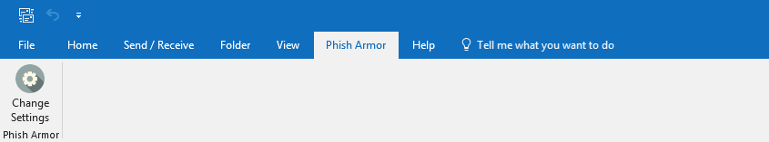
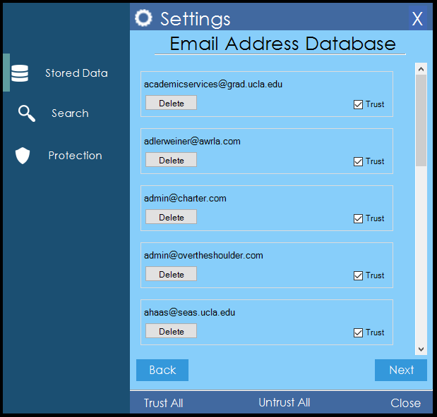
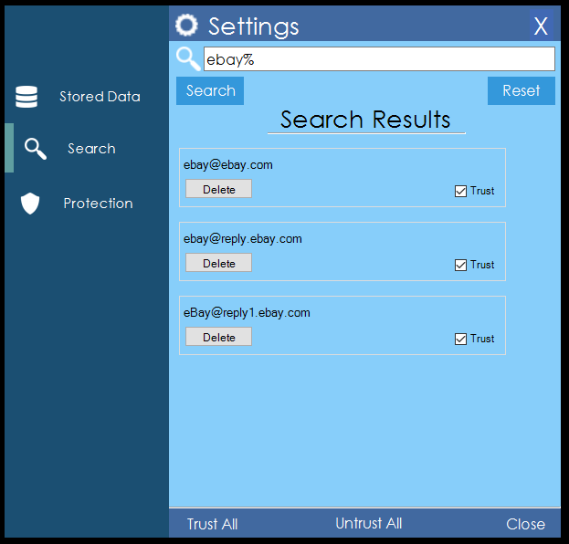
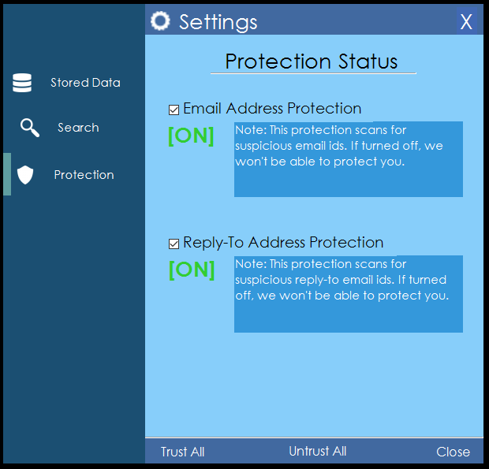

# Phish Armor

**Phish Armor** is a plugin for Outlook that detects spear email phishing attacks. It is easy to use and requires minimal user interacton to work, hence it does not reduce your productivity time. Whenever the user clicks on an email, the plugin checks if the email is suspicious or not and if the email is suspicious, an appropriate warning is generated for the user.

The main idea of this plugin is to help people defend against spear email phishing attack and to be as light weight as possible.

## Getting Started

These instructions will get you a copy of the project up and running on your local machine for development and testing purposes. See deployment for notes on how to deploy the project on a live system.

### Prerequisites

Currently, Phish Armor is only supported for Windows and has been tested on Windows 10 Home. Phish Armor does not have any specific dependency and is designed for **Dot Net Framework 4.5.2**.

### Installing

Please download the setup files from this [link](../setup) and install.

### Uninstalling

Go to *Uninstall or change a program* settings in the Control Panel and search for **PhishArmor**. If this does not completely uninstall the plugin, open Outlook -> File -> Options -> Add-ins -> Go -> Click on *Phish Armor* -> Remove.

## Using Phish Armor

Once the plugin is installed you will see:

Stored Data tab can be used to view all the email addresses stored in the knowledge base. The user has the access to trust all the email ids or to untrust all of them. Moreover, the user can also delete a particular entry from the knowledge base. Hence, this tab can be used to provide fine grain control over the stored meta data.

Search tab can be used to navigate more easily through the meta data stored in knowledge base. The search query does support regular expressions that can be used in MySQL.

Protection tab can be used to selectively turn on/off the two different protection mechanisms provided by Phish Armor. The user has the option to disable **Email Address Protection**, which will result in Phish Armor completely ignoring the related check and the same applies to **Reply-To Protection**.

## Modifying Phish Armor

Phish Armor is distributed under MIT License and hence feel free to fork it and modify the code for adding aditional functionalities. 
